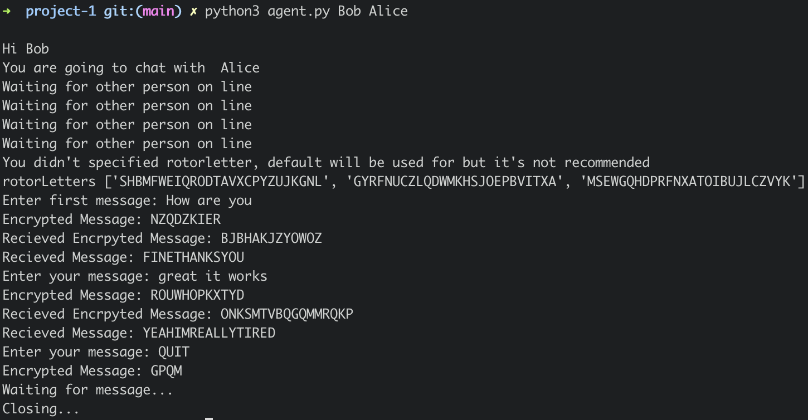
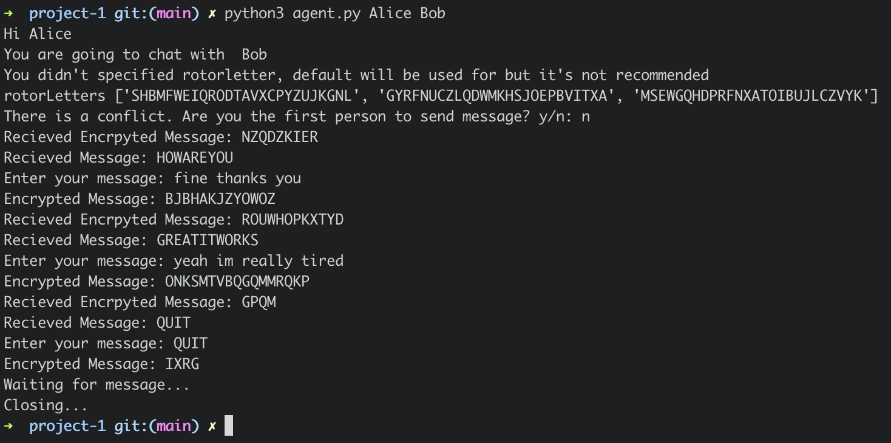
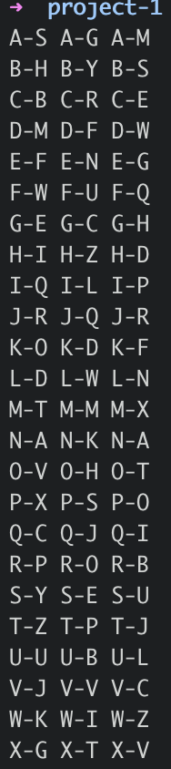

# Modern-Cryptography

Koc University 443: Modern Cryptography Course projects

## Project-1

In this project, I implemented **Enigma** and **Bombe** with **Python3** and completed all the parts in project pdf.

In this project there is also a small example of communication with Enigma.

Even though, Enigma has 3 rotors traditionally, my implemtation of it can have more rotors to increase the break difficult.

For the sake of simplicity, I used default 3 rotors in my examples.

My implementation of rotor has O(1) complexity decrypt, encrypt, turnRotor (click) operations for single letter. Thus, the complexity of same operations for enigma with single letter is O(k) where k is the number of rotors.

### How to run

#### Uncomment test cases and run

```
# This part includes the test cases for Enigma, Rotor and Bombe
python3 main.py
```

#### For secure communication example with enigma run and create two agents

```
# This part includes an communication example
```

For instance

```
# Run from one terminal
python3 agent.py Alice Bob
# Run from another terminal
python3 agent.py Bob Alice
```

#### For Enigma breaker

```
python3 breaker.py
python3 breaker.py targetFile.txt wordList.txt
```

### Additional Functions

```
# Since my implemantion of enigma is flexible, I used this function to determine the number of possibilities for Bombe
enigma.possiblityNumber()

# To visualize current state of enigma
enigma.visualizeEnigma()
```

If you are a Koc University Student please read University Code of Conduct rules

## Images




